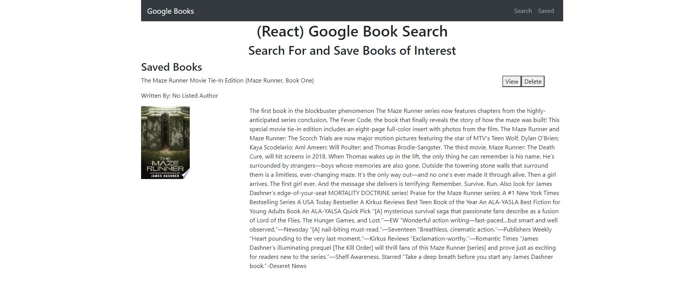

# GoogleBookSearch

## Table of Contents
[Description](#description)

[Installation](#installation)

[Usage](#usage)

[Credits](#credits)

## Description
This repository contains a React Web application. This app allows a user look up books on google books and add them.

### Main page
    Displays a table containing user data and a filter function

## Installation
Downloading respository. In directory run npm install.

## Usage
The application is deployed to https://mysterious-meadow-90024.herokuapp.com/.
Server can be run in test usage with node server.js command.

## Credits
Made By Andrew Ehrman.

### Components Used
Node
React

Google Books Api

Express
MongoDB
socket.io